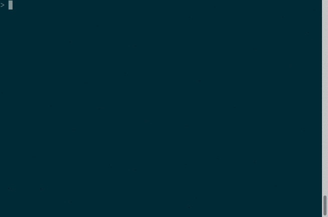

# consoleCAS-SL1
console Cellar Automaton Simulator for FSSP SL1Rule

## Description

コンソールで動く一斉射撃問題のセルラーオートマトンシミュレータ(CAS)です。  
一次元シングルレイヤーマルチビットの遷移規則(SL1Rule)を読み込んで状態遷移をシミュレートできます。

## Features

- コンソール向けのCASです。SL1Ruleの遷移規則ファイルを扱います
- 遷移規則集合を char型 の配列で表現しています
- 近傍情報をbit演算で遷移規則集合のindexに変換することで次の状態を検索します
  - 状態数に応じて bitシフトの量を調節し配列の要素数を抑えています
- エスケープシーケンスを用いて 24bitカラーの出力をおこないます

## Screenshot

## Requirement

- ビルドにはC, C++ が必要です
- 実行するには24bitカラーに対応した端末が必要です
- テストにはGoogleTestが必要です
- 一斉射撃問題ならびに遷移規則ファイルの入手については、お近くの梅尾先生をおたずねください

## Restrictions

- 状態数をchar型で扱っているため、状態数の上限は256状態です(外部状態含む)
  - typedef を変更すれば上限を増やすこともできますが、遷移規則集合のサイズが大きくなります
- 遷移規則集合のサイズは`(int)exp2(((int)ceil(log2(状態数))* 3) * sizeof(char) `です
  - 17 状態の場合 配列のサイズは 512MB です
  -  9 状態の場合 配列のサイズは  64MB です
  -  7 状態の場合 配列のサイズは   8MB です

## Licence

[MIT](https://github.com/michisaka/consoleCAS-SL1/blob/master/LICENSE)

## Author

[道坂 拡司](https://github.com/michisaka/)
