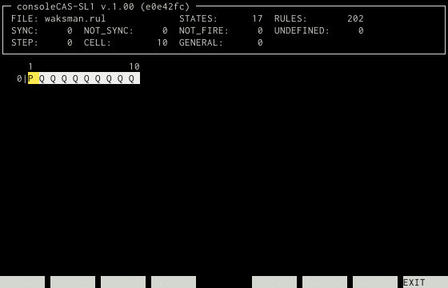

# consoleCAS-SL1
console Cellar Automaton Simulator for FSSP SL1Rule

## Description

コンソールで動く一斉射撃問題のセルラーオートマトンシミュレータ(CAS)です。
一次元シングルレイヤーマルチビットの遷移規則(SL1Rule)を読み込んで状態遷移をシミュレートできます。

## Features

- コンソール向けのCASです。SL1Ruleの遷移規則ファイルを扱います
- 近傍情報をbit演算で遷移規則集合のindexに変換することで次の状態を検索します
  - 状態数に応じて bitシフトの量を調節し配列の要素数を抑えています

## Screenshot

## Requirement

- ビルドにはCMake, C, C++ が必要です
- 実行するにはカラー出力に対応した端末が必要です
- テストにはGoogleTestが必要です
- 一斉射撃問題ならびに遷移規則ファイルの入手については、お近くの梅尾先生をおたずねください

## Usage

    usage: cas [-h] [-c num] [-l[end]] [-w num] [-i ms] rulefile
        -h      ヘルプメッセージの表示
        -c num  セル数 デフォルトは10(-lオプションなし)もしくは2(-lオプションあり)
        -l[end] ループ実行 endはループ終了セル数 デフォルトは1000000
        -w num  セルの表示幅 2から6の数値で指定 デフォルトは2 (1文字+空白)
        -i ms   表示時間間隔 デフォルトは100msec

-lオプションのループ終了セル数は省略可能です。指定する場合は l の直後に(スペースを開けず)数値を指定する必要があります。

実行時には以下の操作が可能です。

- 矢印キー
  - 表示されていない部分をスクロールすることができます
- F8キー
  - アプリケーションを終了します

## Restrictions

- 状態数をchar型で扱っているため、状態数の上限は256状態です(外部状態含む)
  - typedef を変更すれば上限を増やすこともできますが、遷移規則集合のサイズが大きくなります
- 遷移規則集合のサイズは`(int)exp2(((int)ceil(log2(状態数))* 3) * sizeof(char) `です
  - 17 状態の場合 配列のサイズは 512MB です
  -  9 状態の場合 配列のサイズは  64MB です
  -  7 状態の場合 配列のサイズは   8MB です
- 表示間隔を極端に短くした場合表示が乱れることがあります
  - 大量の試験を行いたい場合はバルクモードの実装を予定していますので、そちらをご利用ください
- セルの色はカラーパレットに対して近似されます
- 一般化(将軍位置の移動)は現在は未対応です
 - general_numberの読み方を忘れました
 - 一般化の遷移規則が手元にありません

## Licence

[MIT](https://github.com/michisaka/consoleCAS-SL1/blob/master/LICENSE)

## Author

[道坂 拡司](https://github.com/michisaka/)
